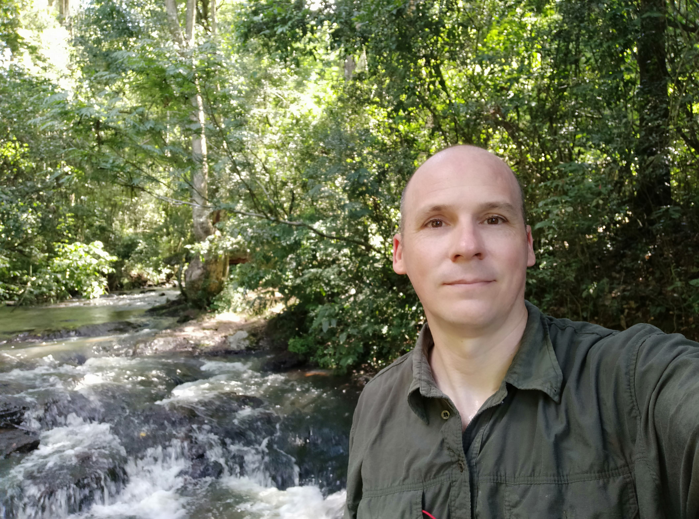

- __Name:__ Ignacio Minoli
- __Occupation:__ Specialist in Biodiversity Databases, GIS and R Programming for environmental decision making
- __Highest Academic Degree:__ PhD in Biological Sciences
- __Core Skills:__ Free Software - Open Source - Linux - R Programming - Bash-Shell Programming - Python Programming - HTML Programming - SublimeText - Rstudio.

Here is a super cool photo of me doing one of my favorite things, trekking. 



<br>
You can checkout all my background and experience <b>here</b>:
<br>

```{r echo=F, out.width="100%", out.height="500"}
knitr::include_graphics('pdf/IM_English_CV.pdf')
```


<!-- # ```{r echo=FALSE} -->
<!-- # # a single file, list or directory. https://bookdown.org/yihui/rmarkdown-cookbook/embed-file.html -->
<!-- # xfun::embed_file("pdf/IM_English_CV.pdf") -->
<!-- # ``` -->
<!-- #  -->
<!-- # Or here # https://community.rstudio.com/t/how-to-link-to-a-file-from-an-included-markdown-document-in-a-shiny-app/45907/2 -->
<!-- #  -->
<!-- #  -->