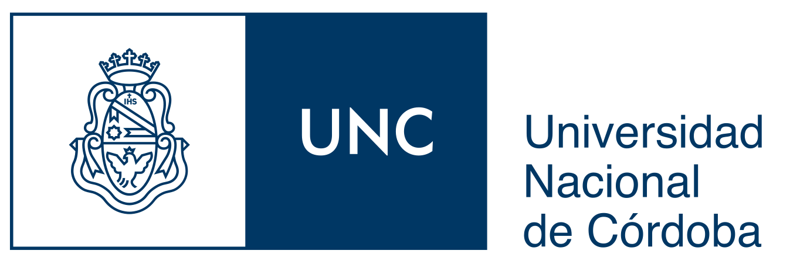

 

  <h2 style="margin:0;">[University degree](https://en.unne.edu.ar/index.php?lang=en)</h2>
  

- Bachelor degree in Zoology. Facultad de Ciencias Exactas y Naturales y Agrimensura, Universidad Nacional del Nordeste. Corrientes. Argentina. March 1998 - 11 March 2006. Overall career average 7.00/10.

 

  <h2 style="margin:0;">[Postgraduate degree](https://www.unc.edu.ar/english/)</h2>
  

- PhD degree in Biological Sciences. Universidad Nacional de Córdoba. Admission: February 3rd, 2011. Graduate: March 18ht, 2015. Thesis topic: Determination of species boundaries in the <i>fitzingerii</i> group lizards of genus <i>Liolaemus</i> (Iguania: Liolaemini). Qualification: Outstanding.

 

## [Postgraduate training courses]()
__(only some of the most significant ones from 23 taken!!)__

- Course name: IV Taller GBIF.ES online: Manejo, visualización y análisis de datos en ecología con R (nivel iniciación).
Organizing Institution: Nodo Español de Biodiversidad GBIF.ES (RJB-CSIC).
Date: 8 October - 26 October, 2021.
Qualification: Degree of sufficiency established.
 

- Course name: Curso Práctico de Modelado de Nichos Ecológicos Modalidad On-Line.
Organizing Institution: Universidad Estatal Amazónica, Centro de Educación Continua.
Date: 18 January - 03 March, 2019.
Qualification: Approved.
 

- Course name: Análisis de Datos Espaciales y sus Aplicaciones.
Organizing Institution: Instituto de Altos Estudios Espaciales "Mario Gulich" - Comisión Nacional de Actividades Espaciales (CONAE).
Date: October 2 – December 10, 2018.
Qualification: 9 (nine).
 

- Course name: Curso Modelado de Nicho Ecológico 2018.
Organizing Institution: Biodiversity Informatics Training Curriculum.
Date: March 1 - August 30, 2018.
Qualification: Approved.
 

- Course name: Fundamentos, evaluación y futuro de los modelos de nicho y distribución de especies.
Organizing Institution: Universidad Nacional de la Patagonia San Juan Bosco.
Date: 16 – 20 November, 2015.
Qualification: Approved.
 

- Course name: Physiological models of climate change impacts.
Organizing Institution: Centro Nacional Patagónico – CONICET.
Date: 12 – 16 September, 2013.
Qualification: Approved.
 

- Course name: Introducción al Análisis Multivariado.
Organizing Institution: Centro Nacional Patagónico – CONICET.
Date: 5 - 9 November, 2012.
Qualification: 8 (eight).
 

- Course name: Sistemas de Información Geográfica (SIG) aplicado a la ecología.
Organizing Institution: Centro Nacional Patagónico – CONICET.
Date: 17 - 21 September, 2012.
Qualification: 10 (ten).
 

- Course name: Curso Introducción al R para la exploración, manipulación y análisis de datos.
Organizing Institution: Centro Nacional Patagónico – CONICET.
Date: 28 May - 1 June, 2012.
Qualification: 10 (ten).
 

- Course name: Hipótesis, modelos y datos: Integrando conceptos.
Organizing Institution: Universidad Nacional de la Patagonia San Juan Bosco.
Date: 9 - 17 February, 2012.
Qualification: 10 (ten).
 
