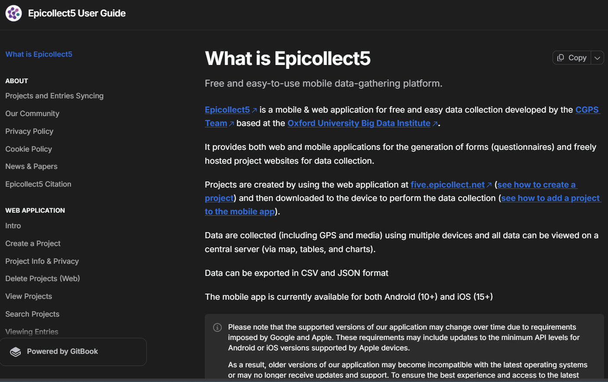

  
  
  <h3>Access the official documentation</h3>
  
Due to security policies on the original site, the platform must open in a new window.

  
  <a href="https://docs.epicollect.net/" target="_blank" class="btn btn-primary btn-visit">
    <i class="fa fa-external-link"></i> Open Epicollect5 in a new tab
  </a>

 

### About this project
Epicollect5 is an essential tool for field data collection, and it’s especially useful for my biodiversity and conservation projects. It allows you to create custom forms and capture geospatial data for free.