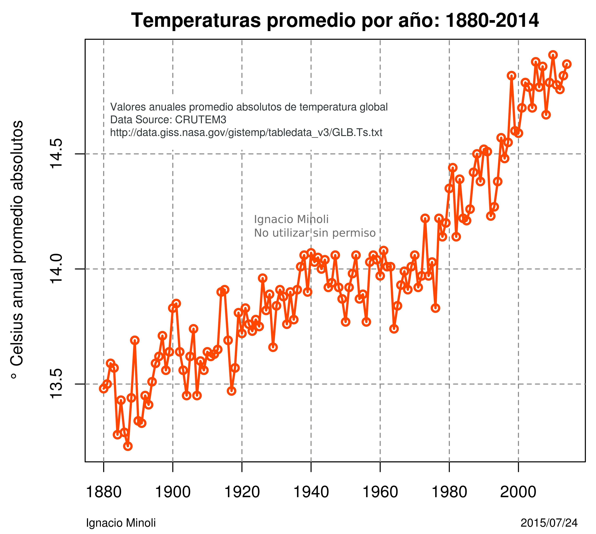
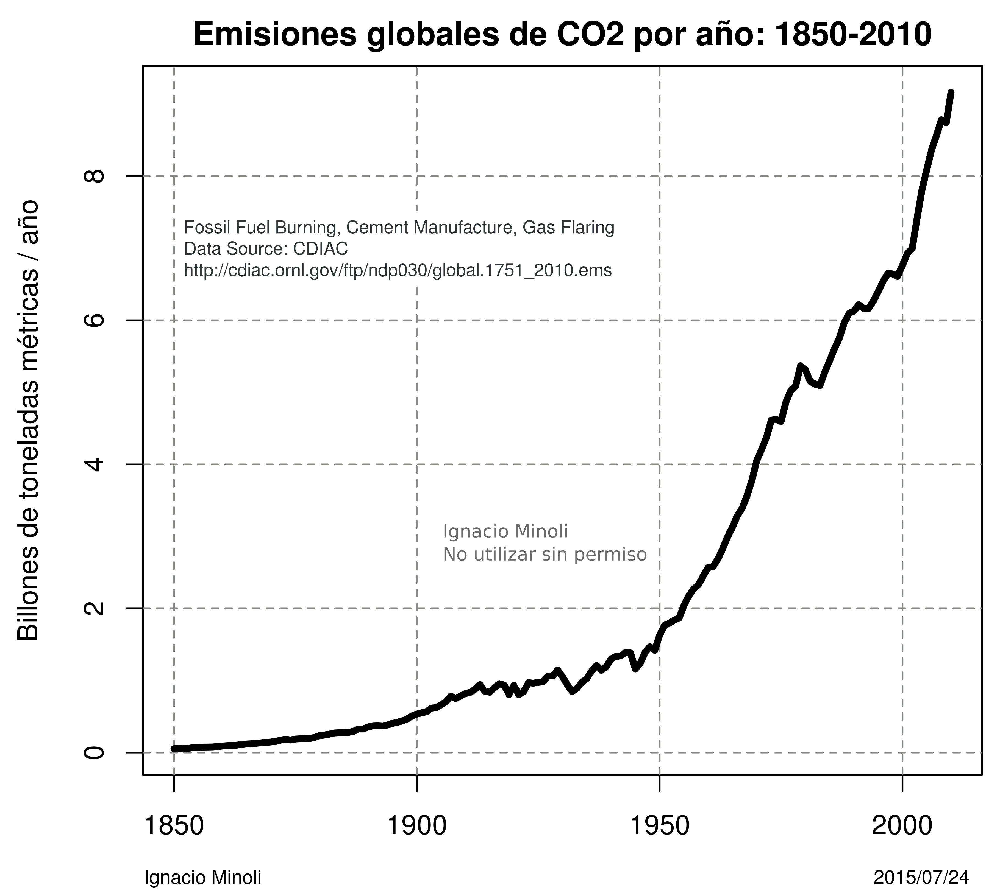
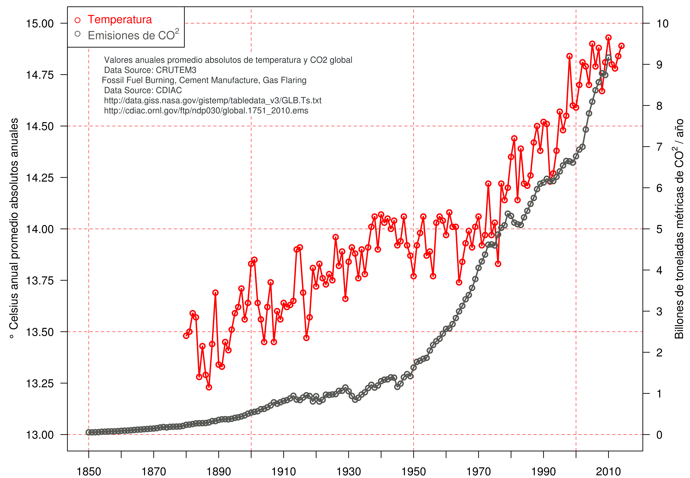
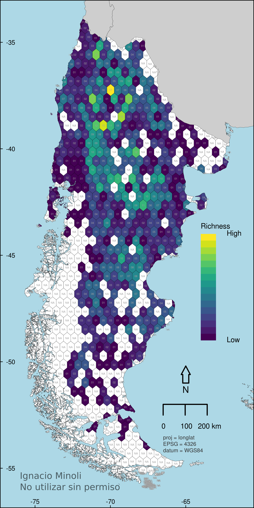
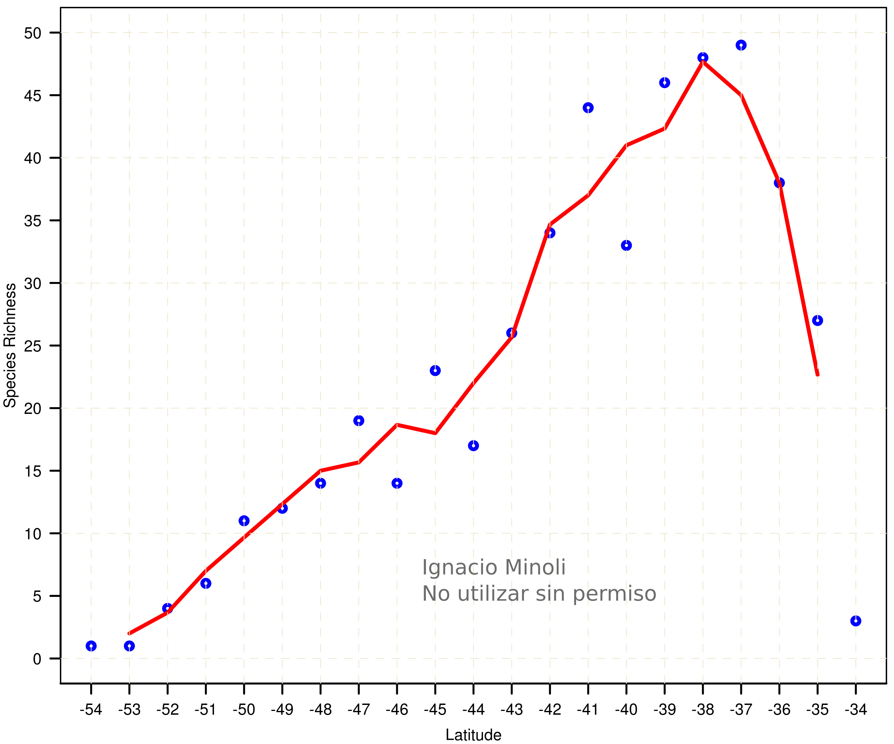

__Some examples of my R plots, maps and results ... still under construction:__ 

Global absolute temperature change levels in celsius degrees.

Global Co2 emmisions.

Global absolute temperature change levels in celsius degrees with the CO2 emmissions.

3D PCA morpho space with morphometric variables in lizards.

Lizard richness in Patagonia.

Latitudinal lizard richness changes in Patagonia

<iframe name="Filter" src="https://redargentinademonitoreodefaunaatropellada.shinyapps.io/RAMFA3_bis/" style='height: 900px; width: 100%;' frameborder="0" scrolling="yes" id="iframe">...</iframe>

Example of shiny app for an interactive reactive map - filter.
