

# A Showcase of Data Science & Visualization

Welcome to my portfolio. This collection highlights my expertise in R for data analysis, geospatial modeling, and the creation of interactive visualizations. Each project demonstrates a unique challenge solved through data-driven insights and technical skill.

---

## Interactive Applications

### Reactive Shiny Map for Large Databases

<iframe width="373" height="210" src="videos/R_Shiny_Map_Reactive.mp4" frameborder="0" allow="accelerometer; autoplay; encrypted-media; gyroscope; picture-in-picture" allowfullscreen></iframe>

This video demonstrates an R Shiny application designed to handle and filter large spatial databases. The app provides reactive, interactive views, enabling users to explore complex datasets dynamically. This approach is ideal for making large volumes of geospatial data accessible and insightful.

Tech Stack: R, Shiny, Spatial Data

### National Data Viz Competition 2024 Entry

<iframe width="373" height="210" src="videos/concurso_nacional_de_visualización_de_datos_2024.mp4" frameborder="0" allow="accelerometer; autoplay; encrypted-media; gyroscope; picture-in-picture" allowfullscreen></iframe>

A submission for the "Concurso Nacional de Visualización de Datos 2024". This video presents a data-driven narrative, focusing on the principles of effective data filtering and storytelling. Explore the full interactive dashboard to dive deeper into the analysis.

Tech Stack: R, Quarto, Data Storytelling

<a href="https://hermeneuta.quarto.pub/contar-con-datos-2024-/#" target="_blank">View Interactive Dashboard</a>

### RAMFA Fauna Monitoring App

An interactive application developed for the Argentine Network for the Monitoring of Fauna Runovers (RAMFA). It features cumulative filters and reactive maps to analyze wildlife roadkill data, aiding in conservation efforts and infrastructure planning.

Tech Stack: R, Shiny, Leaflet

<a href="https://ramfa.shinyapps.io/ramfa3_bis/" target="_blank">View Live App</a>

---

## Geospatial Analysis & Maps

### Species Distribution: *Akodon montensis*

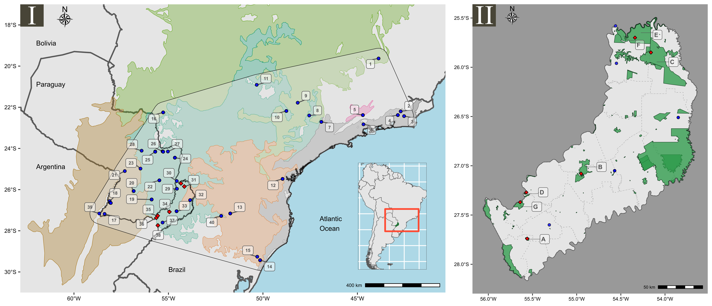

A detailed species distribution map created for a research paper on the genetic diversity and ecological niche of the montane grass mouse (*Akodon montensis*) in the Atlantic Forest.

Tech Stack: R, GIS, Spatial Analysis

### 2022 Corrientes Province Fires

<iframe width="373" height="210" src="videos/Incendios_Ctes_fixed.mp4" frameborder="0" allow="accelerometer; autoplay; encrypted-media; gyroscope; picture-in-picture" allowfullscreen></iframe>

An interactive, self-contained HTML map visualizing the fire scars from February 2022 in Corrientes Province, Argentina. Created with the `rgee` package, it integrates Google Earth Engine capabilities to show multiple layers, including smoke columns.

Tech Stack: R, rgee, Google Earth Engine

### Optimal Conservation Areas in Chile

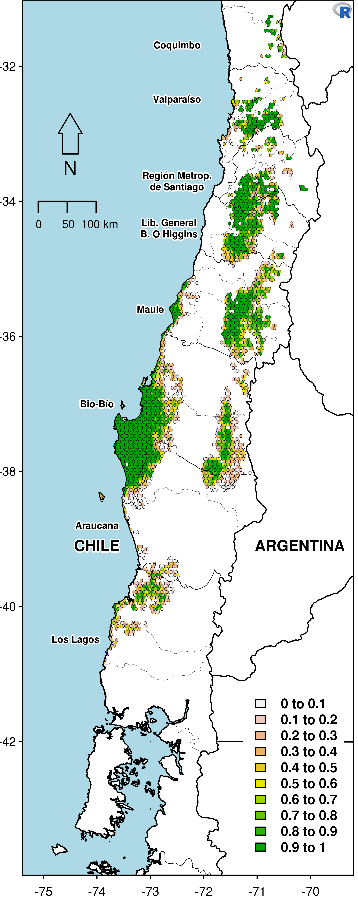
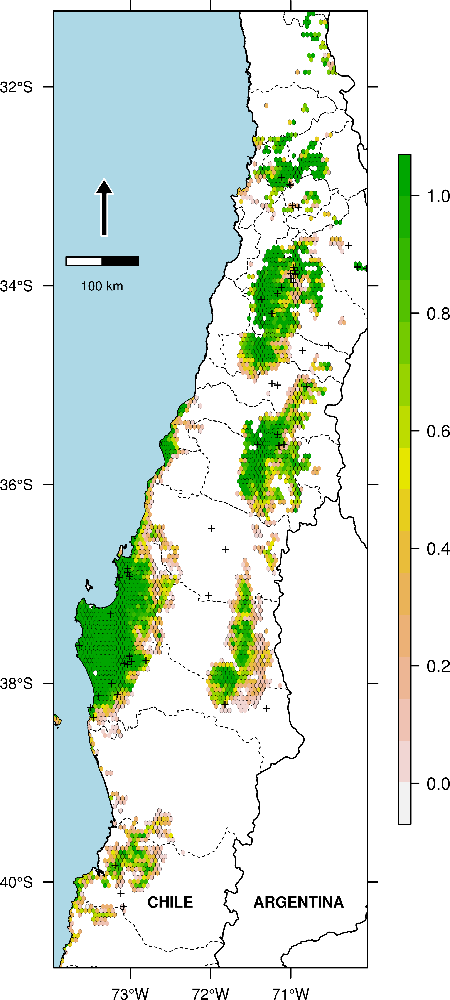

A spatial analysis identifying optimal conservation areas for a lizard assemblage in Chile. The landscape was discretized into cells to quantify and prioritize conservation efforts effectively. The two maps showcase different cartographic styles for presenting the results.

Tech Stack: R, Spatial Optimization, Conservation Planning

### Lizard Richness in Patagonia

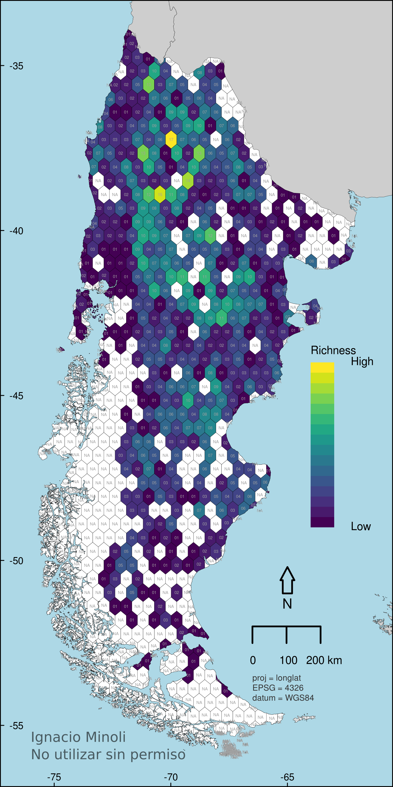

This map visualizes species richness of lizards across Patagonia, based on 14,985 individual occurrence records. The area was spatially discretized into 1,122 hexagonal cells for accurate richness analysis.

Tech Stack: R, Spatial Analysis, Species Distribution Modeling

### NDVI Changes in Misiones Province

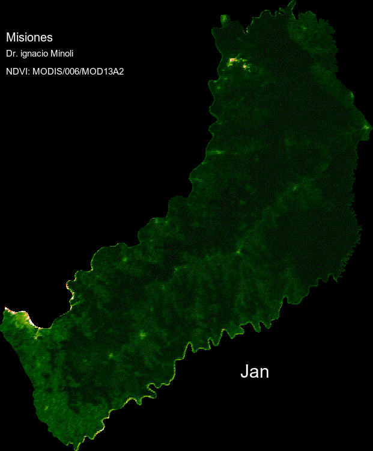

A GIF showcasing the Normalized Difference Vegetation Index (NDVI) changes over a full year in Misiones Province. This animation reveals seasonal patterns and vegetation health dynamics.

Tech Stack: R, rgee, Google Earth Engine, Time Series Analysis

### Future Niche Model Projection

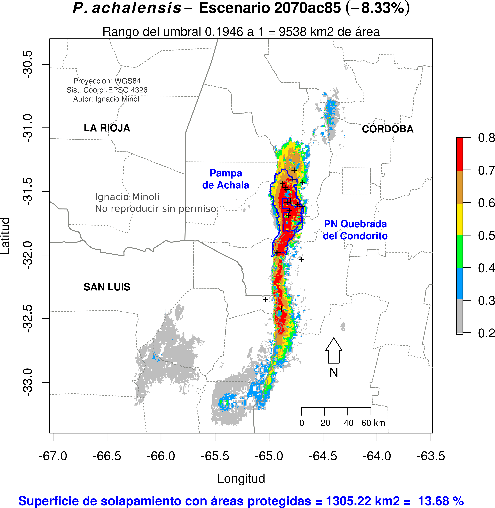

An environmental niche model for an endemic and threatened lizard species, projected to the year 2070 under the `ac87` climate scenario. This visualization helps assess the potential future impacts of climate change on species distribution.

Tech Stack: R, dismo, Climate Modeling

---

## Data Visualizations & Plots

### Global Climate Change Trends

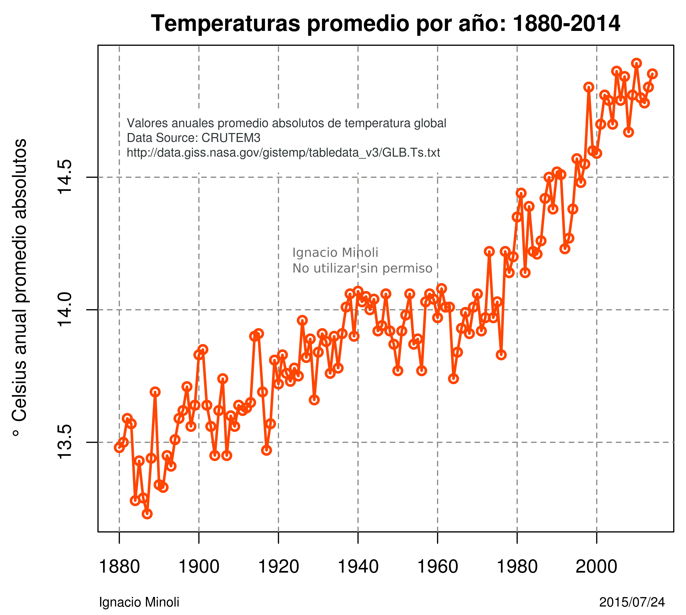
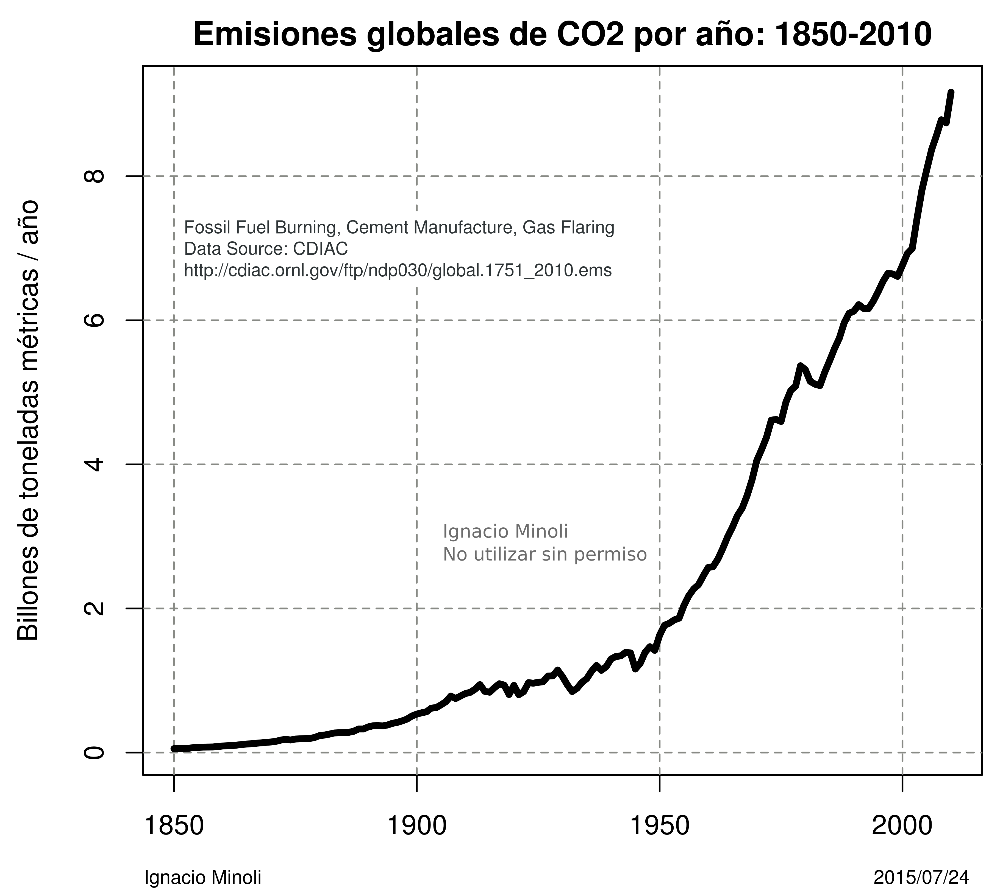
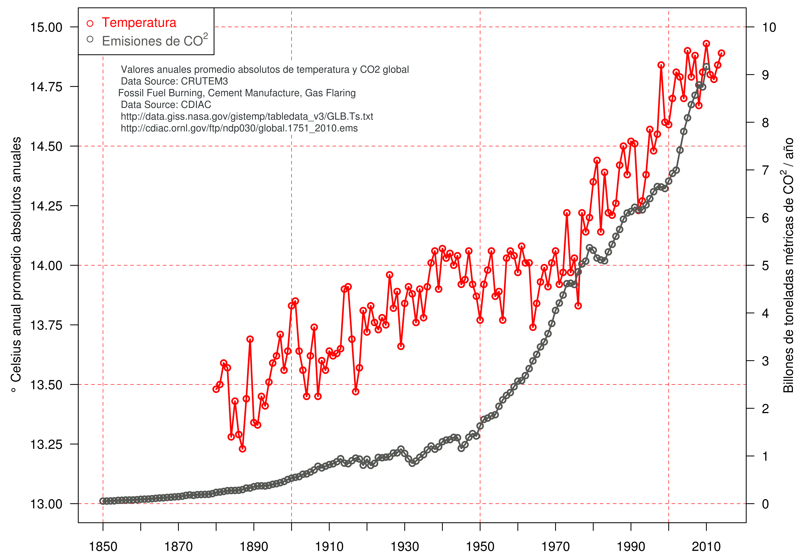

A series of plots visualizing the relationship between global CO2 emissions and absolute temperature changes. Created with base R, these graphics clearly illustrate the long-term climate trends.

Tech Stack: R, Base R Graphics, Climate Data

### 3D Morphometric Space

A 3D visualization of a Principal Component Analysis (PCA) morphospace, based on lizard morphometric variables. This interactive plot helps in understanding the shape variation and relationships within the dataset.

Tech Stack: R, FactoMineR, rgl

### Latitudinal Richness Gradient

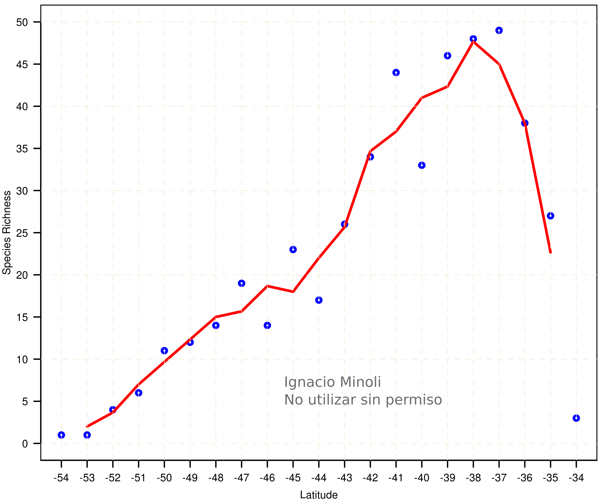

A plot illustrating the latitudinal changes in lizard species richness across Patagonia, based on the hexagonal cell analysis. This type of visualization is key for understanding large-scale biodiversity patterns.

Tech Stack: R, Base R Graphics, Ecology

### Data Summarization with Pie Charts

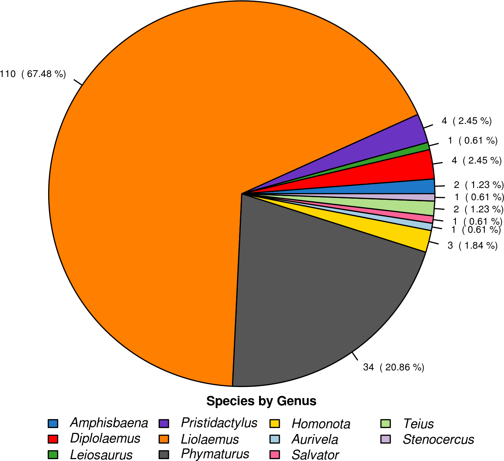

An example of using a pie chart to effectively summarize large categorical datasets, in this case, the number of species per genus. While often criticized, pie charts can be useful for showing parts-of-a-whole at a high level.

Tech Stack: R, Base R Graphics

---

### Featured Project: RAMFA Interactive Dashboard

<iframe name="Filter" src="https://ramfa.shinyapps.io/ramfa3_bis/" frameborder="0" scrolling="yes" id="iframe">...</iframe>

