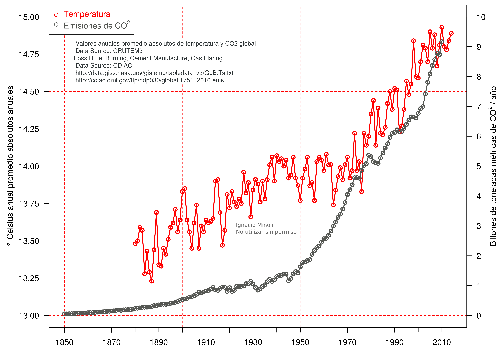

__Some examples of my R plots, maps and results ... still under construction:__ 

<iframe width="373" height="210" src="videos/Incendios_Ctes_fixed.mp4" frameborder="0" allow="accelerometer; autoplay; encrypted-media; gyroscope; picture-in-picture" allowfullscreen></iframe>

Example of html self-contained with __rgee package__ (Google Earth Engine) for February 2022 fires of Corrientes Province (Argentina) with an interactive map. In red soil fire scars and in the right layer some of the smoke columns. Several layers options, scroll in - out, etc. 
Click on __"full screen icon"__ to see changes in full screen. 

Global absolute temperature change levels in celsius degrees with __R-base__.

Global Co2 emmisions with __R-base__.

Global absolute temperature change levels in celsius degrees with the CO2 emmissions with __R-base__.

Selection of optimal conservation areas considering an assemblage of lizards in Chile and two maps with different styles. The areas were discretized into cells to be able to quantify and fragment the possibility of selection and aimed efforts.

3D PCA morpho space with morphometric variables in lizards with __FactoMineR__ and __rgl package__.

Lizard richness in Patagonia. Spatial discretization in 1122 hexagonal cells for species richness considering 14985 records of individual occurrences of lizards.

Latitudinal lizard richness changes in Patagonia in hexagonal cells.

<iframe name="Filter" src="https://ramfa.shinyapps.io/ramfa3_bis/" style='height: 900px; width: 100%;' frameborder="0" scrolling="yes" id="iframe">...</iframe>

Example of an app with __shiny package__ with cumulative filters and reactive interactive maps. Developed for: Argentine Network for the Monitoring Fauna Runovers (RAMFA).

NDVI changes for Misiones Province for a year with __rgee package__ (Google Earth Engine). 
 
 

Environmental niche model projected to 2070 ac87 scenario for an endemic and threatened species of lizard using __dismo package__.
 

Pie chart to summarize large amounts of data with __R-base__.
 